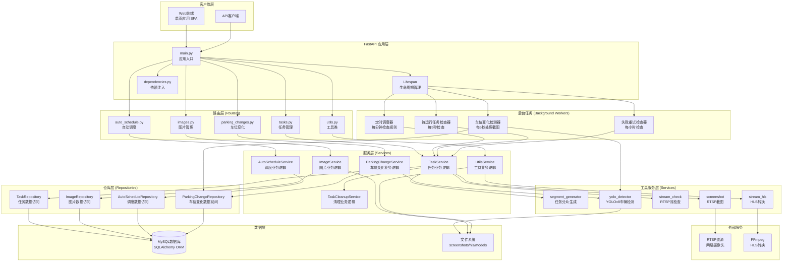
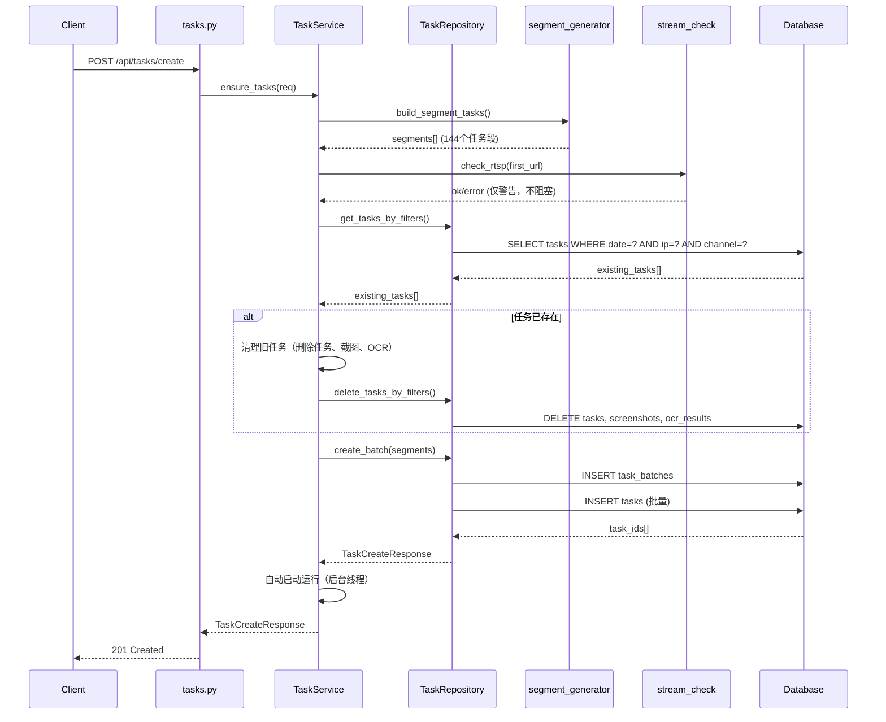
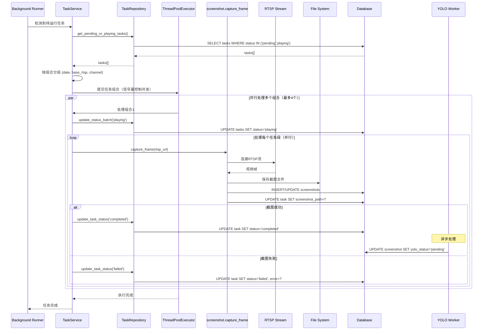
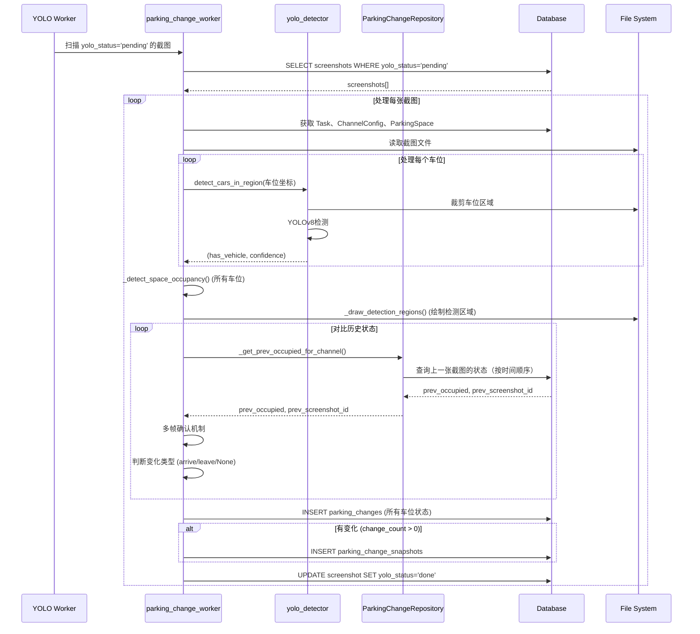
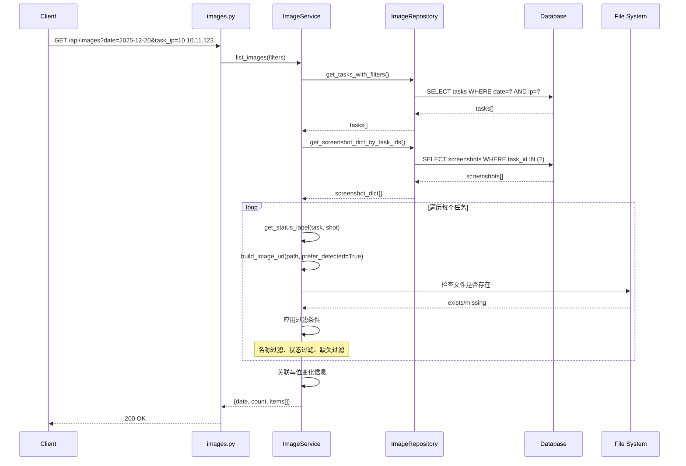
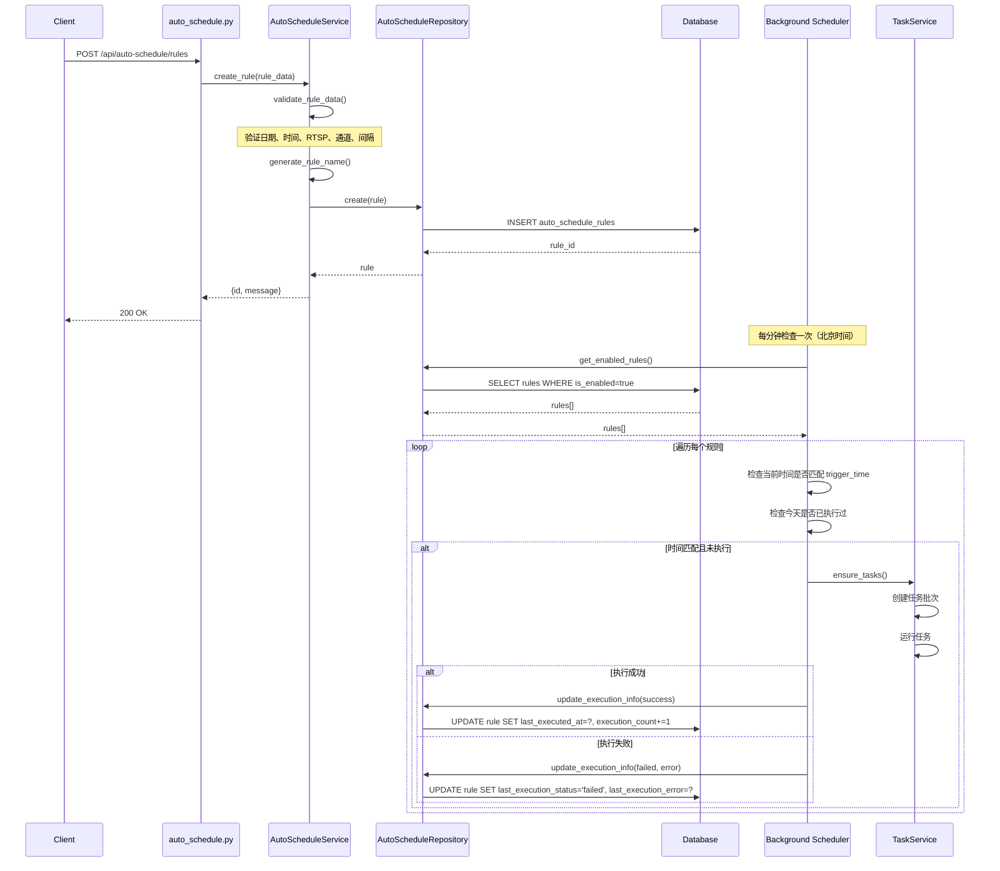
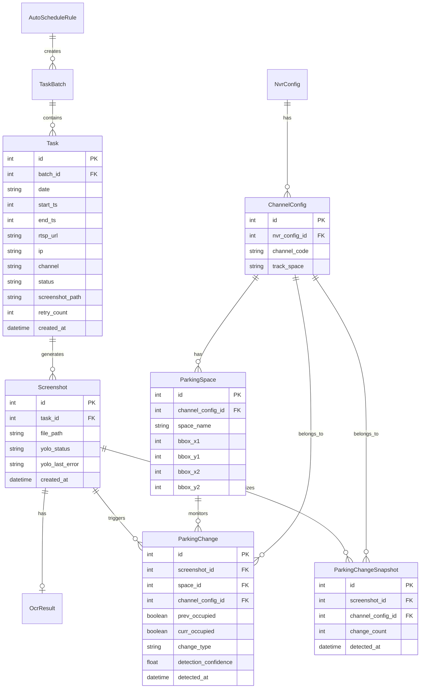
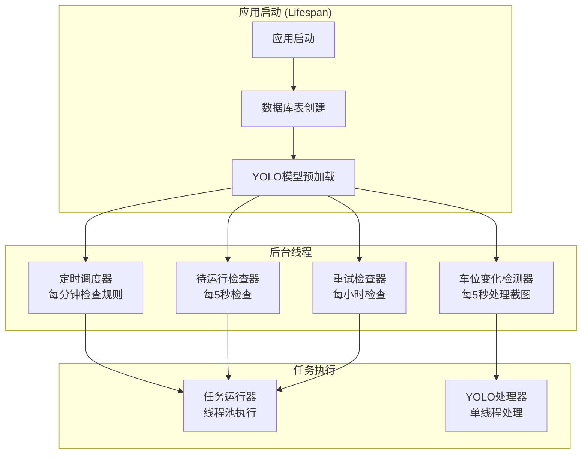
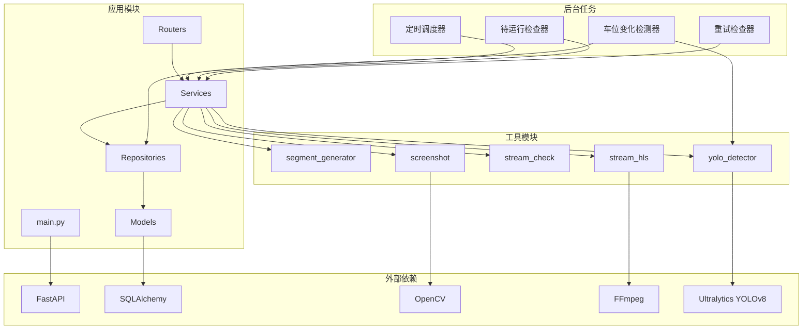
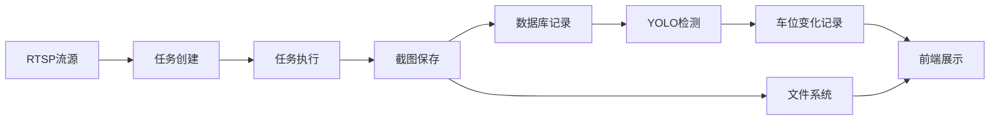

# Smart RTSP Stream Manager - 代码架构流程图与逻辑功能说明

> 本文档基于当前重构后的代码结构，使用 FastAPI 分层架构最佳实践，详细说明系统架构、数据流程和业务逻辑。
> 
> **最后更新**: 2025-12-20
> **文档版本**: 2.0.0

## 📋 目录

1. [系统架构概览](#系统架构概览)
2. [技术栈详解](#技术栈详解)
3. [分层架构设计](#分层架构设计)
4. [核心业务流程](#核心业务流程)
5. [数据模型关系](#数据模型关系)
6. [后台任务机制](#后台任务机制)
7. [API 端点说明](#api-端点说明)
8. [前端架构](#前端架构)
9. [关键逻辑说明](#关键逻辑说明)
10. [性能优化要点](#性能优化要点)
11. [安全考虑](#安全考虑)
12. [扩展性设计](#扩展性设计)

---

## 系统架构概览

### 整体架构图



### 技术栈

#### 后端技术栈

| 技术 | 版本 | 用途 |
|------|------|------|
| **FastAPI** | >=0.110.0 | Web框架，提供RESTful API |
| **SQLAlchemy** | >=2.0.0 | ORM框架，数据库操作 |
| **PyMySQL** | >=1.1.0 | MySQL数据库驱动 |
| **Pydantic** | >=2.5.0 | 数据验证和序列化 |
| **Uvicorn** | >=0.29.0 | ASGI服务器 |
| **OpenCV** | >=4.10.0.84 | 图像处理（截图、绘制） |
| **Ultralytics** | >=8.0.0 | YOLOv8目标检测 |
| **NumPy** | >=1.24.0 | 数值计算 |
| **Pillow** | >=10.0.0 | 图像处理库 |

#### 前端技术栈

| 技术 | 用途 |
|------|------|
| **原生JavaScript** | 前端逻辑实现 |
| **HTML5/CSS3** | 页面结构和样式 |
| **HLS.js** | HLS视频流播放 |
| **Flatpickr** | 日期时间选择器 |

#### 外部工具

| 工具 | 用途 |
|------|------|
| **FFmpeg** | RTSP流转换、HLS生成 |
| **MySQL** | 关系型数据库 |

#### 架构模式

- **分层架构**：Router → Service → Repository → Model
- **Repository Pattern**：数据访问层抽象
- **依赖注入**：FastAPI Depends机制
- **后台任务**：独立线程执行异步任务
- **单例模式**：YOLO模型全局单例

---

## 分层架构设计

### 架构分层说明

采用 **FastAPI 分层架构最佳实践**，遵循以下原则：

```
┌─────────────────────────────────────┐
│  API Layer (Routers)                 │  HTTP请求处理、参数验证
├─────────────────────────────────────┤
│  Service Layer (Business Logic)      │  业务逻辑、数据验证
├─────────────────────────────────────┤
│  Repository Layer (Data Access)     │  数据库操作封装
├─────────────────────────────────────┤
│  Model Layer (Database)             │  数据模型定义
└─────────────────────────────────────┘
```

### 1. 路由层 (Routers)

**职责**: 处理 HTTP 请求和响应，参数验证，调用服务层

**位置**: `app/routers/`

| 模块 | 文件 | 端点数量 | 主要功能 |
|------|------|---------|---------|
| 任务管理 | `tasks.py` | 11个 | 任务创建、查询、运行、删除、重试 |
| 图片管理 | `images.py` | 4个 | 图片查询、代理、可用日期、OCR查询 |
| 自动调度 | `auto_schedule.py` | 4个 | 规则 CRUD、启用/禁用 |
| 工具类 | `utils.py` | 6个 | HLS、健康检查、图片代理、首页、管理接口 |
| 车位变化 | `parking_changes.py` | 4个 | 车位变化查询、分组查询、分析报告、详情 |

**特点**:
- 使用 FastAPI `APIRouter` 组织路由
- 通过 `Depends(get_db)` 注入数据库会话
- 参数验证使用 Pydantic 模型
- 返回标准化的 JSON 响应
- 支持查询参数过滤、分页、排序

**路由注册**:
```python
app.include_router(images.router)
app.include_router(auto_schedule.router)
app.include_router(utils.router)
app.include_router(parking_changes.router)
# tasks.py 的路由在 main.py 中直接定义（历史原因）
```

### 2. 服务层 (Services)

**职责**: 封装业务逻辑，数据验证，调用仓库层和外部服务

**位置**: `app/services/`

| 服务 | 文件 | 主要功能 |
|------|------|---------|
| TaskService | `task_service.py` | 任务创建、查询、运行逻辑、状态管理 |
| ImageService | `image_service.py` | 图片查询、URL构建、状态标签、缺失检查 |
| AutoScheduleService | `auto_schedule_service.py` | 规则验证、名称生成、CRUD、执行管理 |
| UtilsService | `utils_service.py` | HLS启动、健康检查、OCR查询、图片代理 |
| TaskCleanupService | `task_cleanup_service.py` | 任务清理、数据删除、文件清理 |
| ParkingChangeService | `parking_change_service.py` | 车位变化查询、分组、分析报告生成 |

**特点**:
- 业务逻辑与路由解耦
- 可独立测试
- 可复用（多个路由可调用同一服务）
- 集中处理验证和错误处理
- 支持复杂业务逻辑组合

### 3. 仓库层 (Repositories)

**职责**: 封装数据库操作，提供统一的数据访问接口

**位置**: `app/repositories/`

| 仓库 | 文件 | 主要操作 |
|------|------|---------|
| TaskRepository | `task_repository.py` | 任务 CRUD、复杂查询、状态协调、批量操作 |
| ImageRepository | `image_repository.py` | 截图查询、批量获取、日期统计、文件检查 |
| AutoScheduleRepository | `auto_schedule_repository.py` | 规则 CRUD、执行信息更新、启用状态管理 |
| ParkingChangeRepository | `parking_change_repository.py` | 车位变化查询、分组、历史状态查找、时间序列分析 |

**特点**:
- 使用 Repository Pattern
- 封装 SQLAlchemy 查询
- 提供高级查询方法（过滤、分页、排序）
- 支持批量操作
- 处理复杂关联查询
- 时间序列查询优化

### 4. 数据模型层 (Models)

**位置**: `models.py`

| 模型 | 表名 | 关键字段 | 关系 |
|------|------|---------|------|
| TaskBatch | `task_batches` | date, ip, channel, status | 1:N Task |
| Task | `tasks` | date, rtsp_url, status, start_ts, end_ts | N:1 TaskBatch, 1:N Screenshot |
| Screenshot | `screenshots` | task_id, file_path, yolo_status | N:1 Task, 1:1 OcrResult |
| OcrResult | `ocr_results` | screenshot_id, detected_time | N:1 Screenshot |
| AutoScheduleRule | `auto_schedule_rules` | trigger_time, is_enabled | 1:N TaskBatch |
| NvrConfig | `nvr_configs` | nvr_ip, parking_name | 1:N ChannelConfig |
| ChannelConfig | `channel_configs` | nvr_config_id, channel_code, track_space | N:1 NvrConfig, 1:N ParkingSpace |
| ParkingSpace | `parking_spaces` | channel_config_id, space_name, bbox_* | N:1 ChannelConfig |
| ParkingChange | `parking_changes` | screenshot_id, space_id, change_type | N:1 Screenshot, N:1 ParkingSpace |
| ParkingChangeSnapshot | `parking_change_snapshots` | screenshot_id, change_count | N:1 Screenshot |

**关系说明**:
- 所有模型继承自 `Base`（SQLAlchemy declarative_base）
- 使用 `relationship` 定义ORM关系
- 外键约束支持级联删除（CASCADE）或设为NULL（SET NULL）

### 5. 工具服务层 (Services)

**位置**: `services/`

| 服务 | 文件 | 主要功能 |
|------|------|---------|
| segment_generator | `segment_generator.py` | 按时间间隔生成任务分片 |
| screenshot | `screenshot.py` | RTSP流截图、文件保存 |
| stream_check | `stream_check.py` | RTSP流可用性检查 |
| stream_hls | `stream_hls.py` | RTSP转HLS流转换 |
| yolo_detector | `yolo_detector.py` | YOLOv8车辆检测、模型管理 |

**特点**:
- 独立的功能模块
- 可被多个服务层调用
- 封装外部依赖（FFmpeg、OpenCV、YOLO）
- 提供统一的接口

---

## 核心业务流程

### 1. 任务创建流程



**关键步骤**:
1. **参数验证**: 验证日期、RTSP地址、通道格式
2. **生成分片**: 按10分钟间隔生成144个任务段（一天24小时）
3. **RTSP检查**: 验证流可用性（仅警告，不阻塞创建）
4. **清理旧任务**: 如果任务已存在，先删除旧任务、截图和OCR记录
5. **批量创建**: 创建任务批次（TaskBatch）和任务明细（Task）
6. **自动运行**: 创建后自动启动任务执行（后台线程）

### 2. 任务执行流程



**关键步骤**:
1. **任务检测**: 后台检查器定期扫描待运行任务（每5秒）
2. **组合分组**: 按 (date, base_rtsp, channel) 分组
3. **并发控制**: 使用信号量限制并发数（MAX_COMBO_CONCURRENCY=4）
4. **批量标记**: 开始前批量标记为 `playing`
5. **并行截图**: 使用线程池并行处理多个任务段
6. **状态更新**: 每个任务完成后立即更新状态
7. **异步YOLO**: 截图成功后，YOLO Worker异步处理车位检测

### 3. 车位变化检测流程



**关键步骤**:
1. **扫描待处理截图**: 查询 `yolo_status='pending'` 的截图
2. **获取配置**: 获取通道配置和车位坐标
3. **区域检测**: 对每个车位区域进行YOLO检测
4. **历史对比**: 按时间顺序查找上一张截图的状态
5. **多帧确认**: 检查前2帧状态，减少误判
6. **记录变化**: 记录所有车位状态到 `parking_changes`
7. **生成快照**: 如果有变化，生成 `parking_change_snapshots` 记录
8. **绘制标记**: 在图片上绘制检测区域（绿色框）

### 4. 图片查询流程



**关键步骤**:
1. **任务查询**: 根据过滤条件查询任务
2. **批量获取截图**: 一次性获取所有相关截图
3. **状态判断**: 根据任务状态和截图情况确定显示状态
4. **URL构建**: 构建图片访问URL（优先使用 `_detected.jpg`）
5. **文件检查**: 检查文件是否存在，标记 missing
6. **过滤应用**: 应用名称、状态、缺失等过滤条件
7. **关联变化**: 关联车位变化信息（是否有变化）

### 5. 自动调度流程



**关键步骤**:
1. **规则创建**: 验证并创建调度规则
2. **定时检查**: 后台线程每分钟检查一次（北京时间）
3. **时间匹配**: 检查当前时间是否匹配规则的触发时间
4. **防重复执行**: 检查今天是否已执行过
5. **自动执行**: 匹配后自动创建并运行任务
6. **执行记录**: 记录执行结果和错误信息

---

## 数据模型关系

### ER 图



### 数据流转

```
RTSP流 → 截图文件 → Screenshot记录 → Task关联
         ↓
    文件系统存储 (screenshots/日期/)
         ↓
    YOLO检测 → ParkingChange记录 → ParkingChangeSnapshot
         ↓
    通过 /shots/ 或 /api/image_proxy 访问
         ↓
    前端展示（图片列表、车位变化）
```

---

## 后台任务机制

### 后台任务架构



### 1. 定时调度器 (start_schedule_checker)

**功能**: 检查自动分配规则，在指定时间自动创建并运行任务

**执行频率**: 每分钟检查一次

**位置**: `app/main.py` (函数 `check_and_execute_rules`)

**流程**:
1. 获取当前北京时间
2. 查询所有启用的规则
3. 检查当前时间是否匹配规则的 `trigger_time`
4. 检查今天是否已执行过（防止重复执行）
5. 如果匹配且未执行，执行规则：
   - 确定目标日期（use_today 或 custom_date）
   - 调用任务创建和运行服务
   - 更新规则执行信息（last_executed_at, execution_count）

### 2. 待运行任务检查器 (start_pending_runner)

**功能**: 自动检测并执行待运行的任务组合

**执行频率**: 每5秒检查一次

**位置**: `app/main.py` (函数 `start_pending_runner`)

**流程**:
1. 查询状态为 `pending` 或 `playing` 且没有截图的任务
2. 按 (date, base_rtsp, channel) 分组
3. 检查是否已在运行中（RUNNING_KEYS）
4. 如果不在运行中，启动任务执行
5. 使用信号量控制并发数（MAX_COMBO_CONCURRENCY=4）

### 3. 失败重试检查器 (start_failed_task_retry_checker)

**功能**: 自动重试失败的任务

**执行频率**: 每小时检查一次

**位置**: `app/main.py` (函数 `check_and_retry_failed_tasks`)

**流程**:
1. 查询需要重试的失败任务（retry_count < MAX_RETRY_COUNT=3）
2. 检查 `next_retry_at` 是否已到
3. 如果已到，重新运行任务
4. 更新重试次数和下次重试时间（延迟1小时）

### 4. 车位变化检测器 (start_parking_change_detector)

**功能**: 异步处理截图的车位变化检测

**执行频率**: 每5秒处理一批（batch_size=10）

**位置**: `app/background/parking_change_worker.py`

**流程**:
1. 查询 `yolo_status='pending'` 的截图
2. 对每张截图：
   - 获取通道配置和车位坐标
   - 对每个车位区域进行YOLO检测
   - 与历史状态对比，判断变化类型
   - 记录到 `parking_changes` 表
   - 如果有变化，生成 `parking_change_snapshots` 记录
   - 绘制检测区域标记图（`_detected.jpg`）
3. 更新截图状态为 `done` 或 `failed`

**关键特性**:
- 单例模式：YOLO模型全局只加载一次
- 批量处理：每次处理10张截图
- 时间顺序对比：严格按时间顺序对比，不允许跨时间段
- 多帧确认：检查前2帧状态，减少误判

---

## API 端点说明

### 任务管理 API (`/api/tasks`)

| 端点 | 方法 | 功能 | 服务层方法 |
|------|------|------|-----------|
| `/create` | POST | 创建任务 | `TaskService.ensure_tasks()` |
| `/available_dates` | GET | 获取可用日期 | `TaskService.get_available_dates()` |
| `/available_ips` | GET | 获取可用IP | `TaskService.get_available_ips()` |
| `/available_channels` | GET | 获取可用通道 | `TaskService.get_available_channels()` |
| `/configs` | GET | 获取任务配置列表 | `TaskService.get_task_configs()` |
| `/configs` | DELETE | 删除任务配置 | `TaskCleanupService.delete_tasks_by_config()` |
| `/configs/rerun` | POST | 重新运行配置 | `TaskService.rerun_config()` |
| `/paged` | GET | 分页查询任务 | `TaskService.get_tasks_paged()` |
| `/{task_id}` | DELETE | 删除任务 | `TaskCleanupService.delete_task()` |
| `/{task_id}/rerun` | POST | 重新运行任务 | `TaskService.rerun_task()` |
| `/run` | POST | 运行指定任务 | `TaskService.run_tasks()` |
| `/run_all` | POST | 运行所有待运行任务 | `TaskService.run_all_tasks()` |

### 图片管理 API (`/api/images`)

| 端点 | 方法 | 功能 | 服务层方法 |
|------|------|------|-----------|
| `/` | GET | 获取所有图片 | `ImageService.list_images()` |
| `/{date}` | GET | 按日期获取图片 | `ImageService.list_images()` |
| `/available_dates` | GET | 获取可用日期 | `ImageService.get_available_dates()` |
| `/task/{task_id}/ocr` | GET | 获取任务的OCR结果 | `ImageService.get_task_ocr()` |

**搜索参数**:
- `name__eq`: 精准搜索图片名称
- `name__like`: 模糊搜索图片名称
- `task_ip`, `task_ip__like`: IP搜索
- `task_channel`, `task_channel__like`: 通道搜索
- `status_label`, `status_label__in`: 状态标签搜索
- `missing`: 是否缺失

### 自动调度 API (`/api/auto-schedule`)

| 端点 | 方法 | 功能 | 服务层方法 |
|------|------|------|-----------|
| `/rules` | GET | 获取所有规则 | `AutoScheduleService.get_all_rules()` |
| `/rules` | POST | 创建规则 | `AutoScheduleService.create_rule()` |
| `/rules/{rule_id}` | PATCH | 更新规则 | `AutoScheduleService.update_rule()` |
| `/rules/{rule_id}` | DELETE | 删除规则 | `AutoScheduleService.delete_rule()` |

### 车位变化 API (`/api/parking_changes`)

| 端点 | 方法 | 功能 | 服务层方法 |
|------|------|------|-----------|
| `/` | GET | 分页获取变化快照列表 | `ParkingChangeService.list_snapshots()` |
| `/grouped` | GET | 按通道分组获取变化快照 | `ParkingChangeService.list_snapshots_grouped_by_channel()` |
| `/analysis/{channel_config_id}` | GET | 获取通道详细分析报告 | `ParkingChangeService.get_channel_analysis_report()` |
| `/{snapshot_id}` | GET | 获取快照详情 | `ParkingChangeService.get_snapshot_detail()` |

**搜索参数**:
- `date`: 任务日期
- `ip`, `ip__like`: IP搜索
- `channel`, `channel__like`: 通道搜索
- `parking_name`: 车场名称
- `space_name`: 车位编号
- `change_type`: 变化类型（arrive/leave）

### 工具类 API

| 端点 | 方法 | 功能 | 服务层方法 |
|------|------|------|-----------|
| `/healthz` | GET | 健康检查 | `UtilsService.get_health_status()` |
| `/api/hls/start` | GET | 启动HLS流 | `UtilsService.start_hls_stream()` |
| `/api/image_proxy` | GET | 图片代理 | `UtilsService.proxy_image()` |
| `/` | GET | 首页 | `UtilsService.get_index_page()` |
| `/api/admin/clear_all` | POST | 清空所有数据 | `UtilsService.clear_all_data()` |
| `/api/admin/redeploy` | POST | 重新部署系统 | `UtilsService.redeploy_system()` |

---

## 前端架构

### 前端文件结构

```
app/static/
├── index.html          # 主页面（单页应用）
├── css/
│   └── styles.css     # 全局样式
└── js/
    ├── api.js         # API调用封装
    ├── utils.js       # 工具函数
    ├── main.js        # 主逻辑、视图切换
    ├── dashboard.js  # 仪表盘、任务创建
    ├── tasks.js       # 任务列表管理
    ├── images.js      # 图片列表、预览
    ├── parking-changes.js  # 车位变化页面
    ├── nvr-config.js  # NVR配置管理
    └── libs/          # 第三方库
        ├── hls.min.js
        ├── flatpickr.min.js
        └── flatpickr.min.css
```

### 前端视图

| 视图ID | 视图名称 | 主要功能 | JS文件 |
|--------|---------|---------|--------|
| `view-dashboard` | 仪表盘 | 任务创建、RTSP配置 | `dashboard.js` |
| `view-tasks` | 任务列表 | 任务查询、管理 | `tasks.js` |
| `view-images` | 图片列表 | 图片查询、预览 | `images.js` |
| `view-parking-changes` | 车位变化 | 变化查询、对比分析 | `parking-changes.js` |
| `view-nvr-config` | NVR配置 | 配置管理、坐标设置 | `nvr-config.js` |

### 前端特性

1. **单页应用 (SPA)**: 所有视图在一个HTML页面中，通过JavaScript切换
2. **全局图片预览**: 支持单图和多图对比预览（模态框）
3. **动态筛选**: 支持多条件组合搜索
4. **实时更新**: 支持定时刷新数据
5. **响应式设计**: 适配不同屏幕尺寸

---

## 关键逻辑说明

### 1. 任务状态流转

```
pending → playing → completed
                ↓
             failed → (retry) → playing → completed/failed
```

**状态说明**:
- `pending`: 任务已创建，等待执行
- `playing`: 任务正在执行中
- `completed`: 任务执行成功，已生成截图
- `failed`: 任务执行失败

**状态协调**: `TaskRepository.reconcile_task_status()` 定期检查并修正状态不一致的任务

### 2. 一任务一图原则

**设计原则**: 每个任务只保留一张最新截图

**实现方式**:
- 截图时检查是否已有截图记录
- 如果存在，更新现有记录的文件路径
- 如果不存在，创建新记录
- 保证 `tasks` 和 `screenshots` 的一对一关系

### 3. 并发控制机制

**全局并发限制**: `MAX_COMBO_CONCURRENCY = 4`

**实现方式**:
- 使用 `threading.Semaphore` 控制并发数
- 每个任务组合执行前获取信号量
- 执行完成后释放信号量
- 防止过多并发导致资源耗尽

### 4. 图片URL构建策略

**策略1**: 相对路径在截图目录下
- URL: `/shots/{相对路径}`
- 通过 FastAPI StaticFiles 直接访问

**策略2**: 绝对路径或不在截图目录下
- URL: `/api/image_proxy?path={路径}`
- 通过代理端点访问，支持任意路径

**策略3**: 优先使用检测标记图
- 如果存在 `_detected.jpg`，优先返回该URL
- 如果不存在，回退到原始图片

### 5. 自动调度规则验证

**验证项**:
1. 日期选择: `use_today` 和 `custom_date` 互斥
2. 触发时间: 格式为 `HH:mm`，范围 00:00-23:59
3. RTSP地址: 必须以 `rtsp://` 开头
4. 通道格式: 必须为 `c1`, `c2`, `c3` 等格式
5. 间隔分钟: 范围 1-1440 分钟

**规则名称生成**: 如果未提供名称，自动生成 `{ip}_{channel}_{trigger_time}`

### 6. HLS 流转换流程

```
RTSP流 → FFmpeg探测 → 启动FFmpeg进程 → 等待m3u8生成 → 返回m3u8 URL
```

**关键步骤**:
1. **RTSP探测**: 使用 `probe_rtsp()` 验证流可用性
2. **进程启动**: 使用 `start_hls()` 启动 FFmpeg 进程
3. **文件等待**: 轮询等待 `index.m3u8` 文件生成（最多20秒）
4. **进程管理**: 将进程保存在 `HLS_PROCS` 字典中
5. **错误处理**: 如果超时或进程退出，返回错误信息

### 7. 车位变化检测逻辑

**检测策略**:
1. **优先方案**: 车位区域直接检测（区域 >= 16x16）
2. **回退方案**: 跟踪区域 + 交集计算（区域 < 16x16）

**对比逻辑**:
1. **严格按时间顺序**: 图1→图2，图2→图3...
2. **时间间隔检查**: 最大允许15分钟（截图间隔10分钟）
3. **多帧确认**: 检查前2帧状态，减少误判

**变化类型**:
- `arrive`: 无车 → 有车（进车）
- `leave`: 有车 → 无车（离开）
- `None`: 无变化或第一张图

---

## 性能优化要点

### 1. 数据库查询优化

- **索引**: `date`, `ip`, `channel` 字段建立索引
- **批量操作**: 使用批量插入和更新
- **查询优化**: 使用 JOIN 减少查询次数
- **分页**: 所有列表查询支持分页
- **时间序列查询**: 使用时间字段而非ID进行排序和过滤

### 2. 并发控制

- **信号量**: 限制任务组合并发数（MAX_COMBO_CONCURRENCY=4）
- **线程池**: 使用 ThreadPoolExecutor 管理线程
- **进程管理**: HLS 进程字典管理，避免进程泄漏
- **单例模式**: YOLO模型全局只加载一次

### 3. 文件系统优化

- **静态文件**: 使用 FastAPI StaticFiles 直接服务
- **路径缓存**: 相对路径计算缓存
- **批量操作**: 文件删除批量执行
- **临时文件**: YOLO检测使用临时文件，检测后立即清理

### 4. 内存优化

- **模型单例**: YOLO模型全局单例，避免重复加载
- **批量处理**: 截图批量处理，避免内存积累
- **及时释放**: 检测完成后及时释放资源

---

## 安全考虑

### 1. SQL注入防护

- **参数化查询**: 所有数据库查询使用参数化
- **输入验证**: 服务层验证所有输入参数
- **类型检查**: 使用 Pydantic 模型验证

### 2. 文件访问安全

- **路径验证**: 验证文件路径，防止目录遍历
- **文件存在检查**: 访问前检查文件是否存在
- **权限控制**: 只允许访问指定目录下的文件

### 3. 资源限制

- **并发限制**: 限制同时运行的任务数
- **超时控制**: HLS 启动设置超时时间
- **资源清理**: 后台任务异常时清理资源
- **重试限制**: 失败任务最多重试3次

---

## 扩展性设计

### 1. 模块化设计

- **分层架构**: 路由、服务、仓库分离
- **依赖注入**: 使用 FastAPI Depends 注入依赖
- **接口抽象**: Repository Pattern 便于替换实现

### 2. 可扩展点

- **新路由**: 添加新的路由模块，注册到 main.py
- **新服务**: 在 services 目录添加新服务
- **新仓库**: 在 repositories 目录添加新仓库
- **新模型**: 在 models.py 添加新模型
- **新后台任务**: 在 background 目录添加新Worker

### 3. 配置化

- **环境变量**: 支持通过环境变量配置
- **常量配置**: 核心常量集中在 constants.py
- **路径配置**: 所有路径配置集中在 config.py
- **YOLO参数**: 支持通过环境变量配置YOLO参数

---

## 测试架构

### 测试分层

```
集成测试 (API层)
    ↓
功能测试 (Service层)
    ↓
单元测试 (Repository层)
```

### 测试覆盖

| 测试文件 | 测试类型 | 覆盖模块 |
|---------|---------|---------|
| `test_task_repository.py` | 单元测试 | TaskRepository |
| `test_task_api_integration.py` | 集成测试 | 任务管理API |
| `test_image_api_integration.py` | 集成测试 | 图片管理API |
| `test_auto_schedule_api_integration.py` | 集成测试 | 自动调度API |
| `test_utils_api_integration.py` | 集成测试 | 工具类API |

**测试结果**: 所有测试通过率 100% ✅

---

## 配置与常量

### 核心配置 (`app/core/config.py`)

| 配置项 | 说明 | 默认值 |
|--------|------|--------|
| `SCREENSHOT_BASE` | 截图存储目录 | `PROJECT_ROOT/screenshots` |
| `HLS_BASE` | HLS输出目录 | `PROJECT_ROOT/hls` |
| `STATIC_DIR` | 静态文件目录 | `app/static` |
| `MAX_COMBO_CONCURRENCY` | 最大并发组合数 | 4 |
| `HLS_PROCS` | HLS进程字典 | `{}` |
| `TASK_STORE` | 任务存储字典 | `{}` |
| `RUNNING_KEYS` | 运行中任务键集合 | `set()` |

### 常量定义 (`app/core/constants.py`)

| 常量 | 说明 | 值 |
|------|------|-----|
| `DEFAULT_PAGE_SIZE` | 默认分页大小 | 20 |
| `MIN_PAGE_SIZE` | 最小分页大小 | 10 |
| `MAX_PAGE_SIZE` | 最大分页大小 | 50 |
| `MAX_RETRY_COUNT` | 最大重试次数 | 3 |
| `TASKS_PREFIX` | 任务API前缀 | `/api/tasks` |

### YOLO配置 (环境变量)

| 环境变量 | 说明 | 默认值 |
|---------|------|--------|
| `YOLO_MODEL_NAME` | 模型名称 | `yolov8n.pt` |
| `YOLO_CUSTOM_MODEL_PATH` | 自定义模型路径 | - |
| `YOLO_CONF_THRESHOLD` | 置信度阈值 | `0.25` |
| `YOLO_MIN_REGION_SIZE` | 最小区域尺寸 | `16` |
| `YOLO_REGION_PADDING` | 区域padding | `10` |

---

## 依赖关系图



---

## 数据流转总览

### 完整数据流



### 关键数据表

1. **任务管理**: `task_batches` → `tasks` → `screenshots`
2. **配置管理**: `nvr_configs` → `channel_configs` → `parking_spaces`
3. **变化检测**: `screenshots` → `parking_changes` → `parking_change_snapshots`

---

## 总结

### 架构优势

1. **清晰的分层**: 路由、服务、仓库职责明确
2. **易于测试**: 每层可独立测试
3. **易于维护**: 代码组织清晰，易于定位问题
4. **易于扩展**: 模块化设计，添加功能不影响现有代码
5. **符合最佳实践**: 遵循 FastAPI 和 Python 最佳实践
6. **高性能**: 并发控制、批量操作、索引优化

### 系统特性

- ✅ **自动化**: 自动调度、自动执行、自动重试
- ✅ **智能化**: YOLO车辆检测、多帧确认、时间序列分析
- ✅ **可视化**: 检测区域标记、对比分析报告
- ✅ **可扩展**: 模块化设计，易于添加新功能
- ✅ **高性能**: 并发控制、批量处理、查询优化

### 重构成果

- ✅ **代码分离**: 2400+ 行代码分离到多个模块
- ✅ **测试覆盖**: 34个测试用例，100% 通过率
- ✅ **API兼容**: 保持所有 API 接口向后兼容
- ✅ **文档完善**: 完整的代码文档和测试文档
- ✅ **功能增强**: 添加车位变化检测、NVR配置管理

---

**文档版本**: 2.0.0  
**最后更新**: 2025-12-20  
**维护者**: QJZH Team
