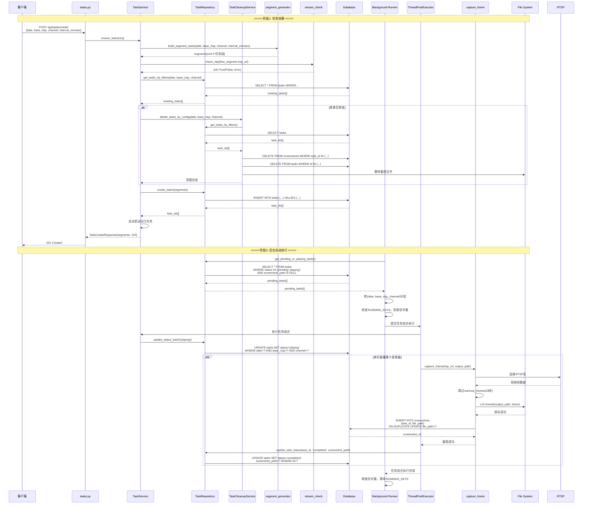
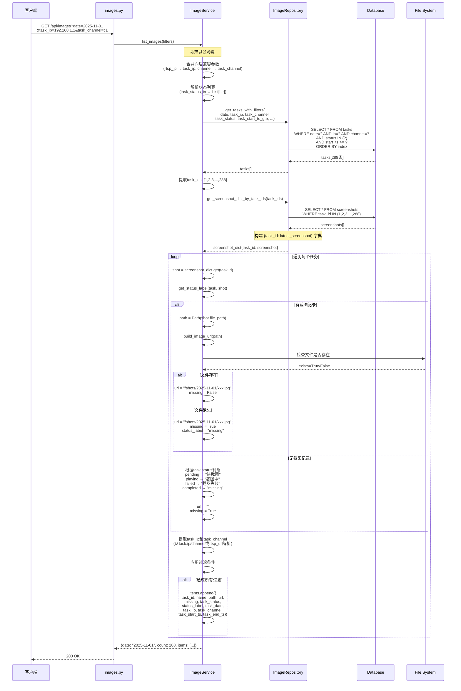
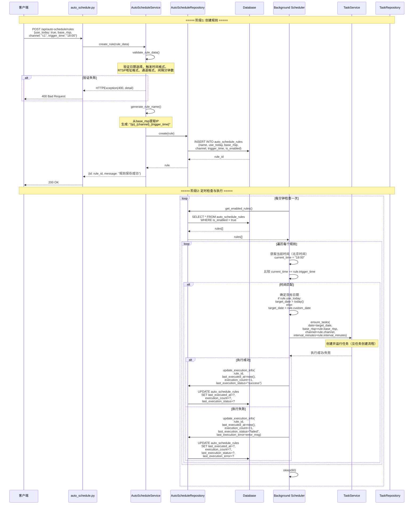
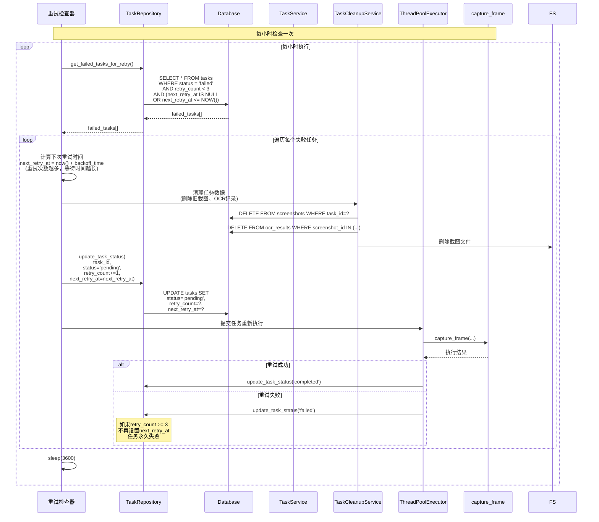
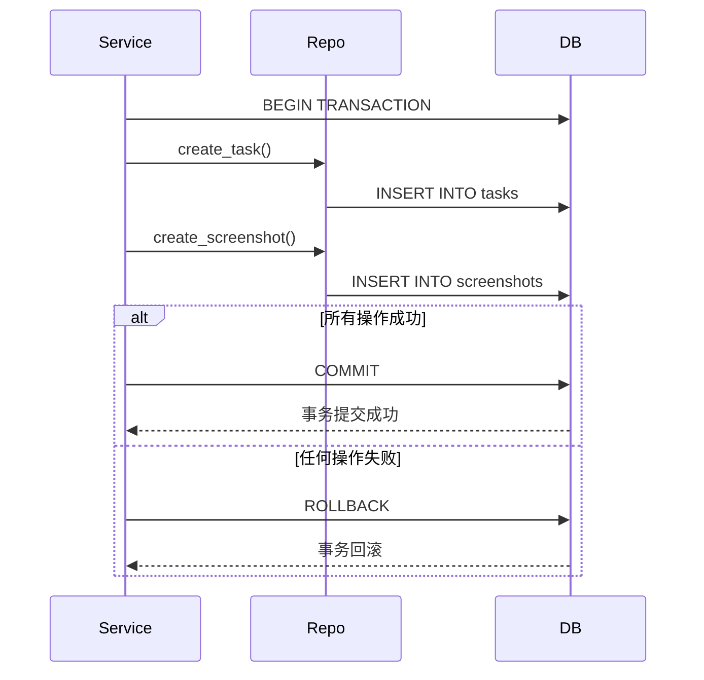
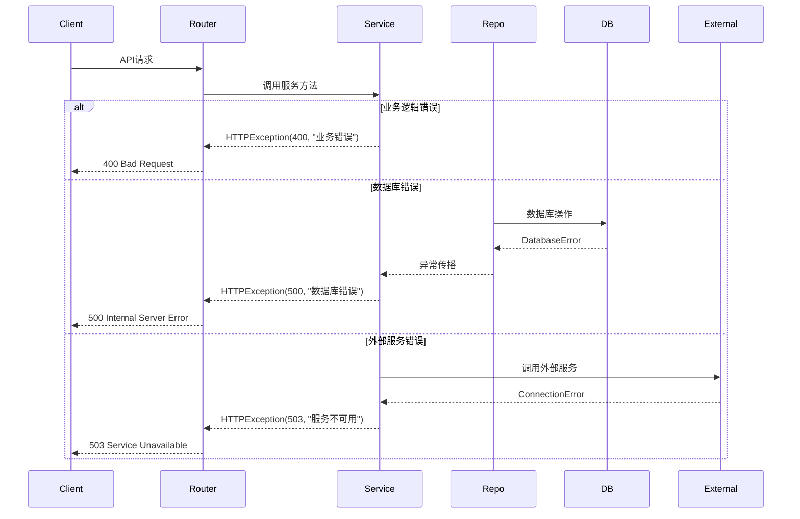

# Smart RTSP Stream Manager - 详细业务流程序列图

> 本文档提供关键业务流程的详细序列图，展示各组件之间的交互时序。

## 📋 目录

1. [任务创建与执行完整流程](#任务创建与执行完整流程)
2. [图片查询与展示流程](#图片查询与展示流程)
3. [自动调度规则执行流程](#自动调度规则执行流程)
4. [HLS流转换流程](#hls流转换流程)
5. [任务重试流程](#任务重试流程)

---

## 任务创建与执行完整流程

### 完整序列图



### 关键时间点

| 阶段 | 操作 | 耗时估算 |
|------|------|---------|
| 任务创建 | 生成144个任务段 | ~100ms |
| RTSP检查 | 验证流可用性 | ~2-5s |
| 清理旧任务 | 删除旧数据和文件 | ~500ms-2s |
| 批量插入 | 插入144条记录 | ~200ms |
| 后台执行 | 并行截图144个任务 | ~5-10分钟 |

---

## 图片查询与展示流程

### 详细序列图



### 过滤逻辑说明

**过滤顺序**:
1. **数据库查询过滤**: date, task_ip, task_channel, task_status, 时间范围
2. **内存过滤**: name_eq, name_like, status_label, status_label_in, missing

**性能优化**:
- 数据库查询使用索引字段（date, ip, channel）
- 批量获取截图，减少查询次数
- 文件存在性检查批量进行

---

## 自动调度规则执行流程

### 详细序列图



### 执行时机说明

**时间匹配逻辑**:
- 使用北京时间（UTC+8）
- 精确匹配到分钟（HH:mm）
- 每分钟检查一次，确保不遗漏

**执行记录**:
- `last_executed_at`: 上次执行时间
- `execution_count`: 累计执行次数
- `last_execution_status`: 上次执行状态（success/failed）
- `last_execution_error`: 失败时的错误信息

---

## HLS流转换流程

### 详细序列图

```mermaid
sequenceDiagram
    participant Client as 客户端
    participant Router as utils.py
    participant Service as UtilsService
    participant Probe as probe_rtsp
    participant FFmpeg as FFmpeg进程
    participant FS as File System
    participant Config as config.py
    
    Client->>Router: GET /api/hls/start?rtsp_url=rtsp://...
    Router->>Service: start_hls_stream(rtsp_url)
    
    Service->>Probe: probe_rtsp(rtsp_url, timeout=5)
    Note over Probe: ffmpeg -rtsp_transport tcp<br/>-stimeout 5000000<br/>-i rtsp_url -t 1 -f null -
    
    alt RTSP探测成功
        Probe-->>Service: (ok=True, err=None)
    else RTSP探测失败
        Probe-->>Service: (ok=False, err="连接超时")
        Note over Service: 记录警告，但继续执行
    end
    
    Service->>Service: 生成唯一键<br/>key = uuid.uuid4()
    Service->>Service: 创建输出目录<br/>out_dir = HLS_BASE / key
    
    Service->>FFmpeg: start_hls(rtsp_url, out_dir, "index")
    Note over FFmpeg: ffmpeg -rtsp_transport tcp<br/>-i rtsp_url<br/>-c:v libx264 -preset veryfast<br/>-c:a aac -b:a 128k<br/>-f hls -hls_time 2<br/>-hls_list_size 5<br/>-hls_flags delete_segments<br/>output_dir/index.m3u8
    
    FFmpeg-->>Service: proc (Popen对象)
    
    alt FFmpeg启动失败
        Service-->>Router: HTTPException(500, "FFmpeg启动失败")
        Router-->>Client: 500 Internal Server Error
    end
    
    Service->>Service: 等待m3u8文件生成<br/>wait_time = 20秒<br/>poll_interval = 0.5秒
    
    loop 轮询检查（最多20秒）
        Service->>FS: 检查 index.m3u8 是否存在
        FS-->>Service: exists=True/False
        
        alt 文件已生成
            break 退出循环
        else 文件未生成
            Service->>FFmpeg: 检查进程状态 proc.poll()
            
            alt 进程已退出
                Service->>FFmpeg: proc.terminate()
                Service-->>Router: HTTPException(500, "FFmpeg异常退出")
                Router-->>Client: 500 Internal Server Error
            else 进程运行中
                Service->>Service: sleep(0.5)
            end
        end
    end
    
    alt 超时未生成m3u8
        Service->>FFmpeg: proc.terminate()
        Service-->>Router: HTTPException(500, "未生成m3u8")
        Router-->>Client: 500 Internal Server Error
    else m3u8生成成功
        Service->>Config: HLS_PROCS[key] = proc
        Service->>Service: m3u8_url = "/hls/{key}/index.m3u8"
        Service->>Service: warn = None if ok else "RTSP探测失败..."
        
        Service-->>Router: {m3u8: m3u8_url, warn: warn}
        Router-->>Client: 200 OK
    end
    
    Note over Client,Config: 客户端使用返回的m3u8 URL<br/>通过 /hls/{key}/index.m3u8 访问HLS流
```

### FFmpeg参数说明

**关键参数**:
- `-rtsp_transport tcp`: 使用TCP传输，更稳定
- `-c:v libx264`: 视频编码为H.264
- `-preset veryfast`: 编码速度预设
- `-f hls`: 输出格式为HLS
- `-hls_time 2`: 每个片段2秒
- `-hls_list_size 5`: 播放列表保留5个片段
- `-hls_flags delete_segments`: 自动删除旧片段

---

## 任务重试流程

### 详细序列图



### 重试策略

**重试次数**: 最多3次

**退避策略**: 
- 第1次重试: 立即重试
- 第2次重试: 等待1小时后重试
- 第3次重试: 等待2小时后重试

**重试条件**:
- `status = 'failed'`
- `retry_count < 3`
- `next_retry_at <= NOW()` 或 `next_retry_at IS NULL`

---

## 数据一致性保证

### 事务处理



### 状态协调机制

**问题**: 任务状态可能与实际执行情况不一致

**解决方案**: `TaskRepository.reconcile_task_status()`

```python
# 检查逻辑
1. 查询 status='playing' 但 updated_at 超过1小时的任务
2. 检查是否有截图记录
3. 如果有截图 → 更新为 'completed'
4. 如果没有截图 → 更新为 'failed'
```

---

## 错误处理流程

### 统一错误处理



### 错误码说明

| HTTP状态码 | 说明 | 示例 |
|-----------|------|------|
| 200 | 成功 | 查询成功 |
| 201 | 创建成功 | 任务创建成功 |
| 400 | 请求错误 | 参数验证失败 |
| 404 | 资源不存在 | 任务不存在 |
| 500 | 服务器错误 | 数据库错误、FFmpeg错误 |
| 503 | 服务不可用 | RTSP流不可用 |

---

**文档版本**: 1.0.0  
**最后更新**: 2025-01-XX  
**维护者**: QJZH Team

